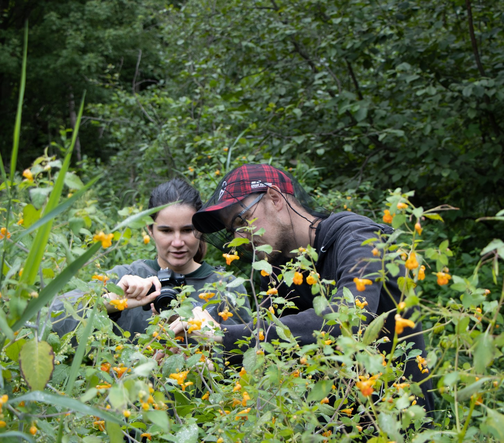
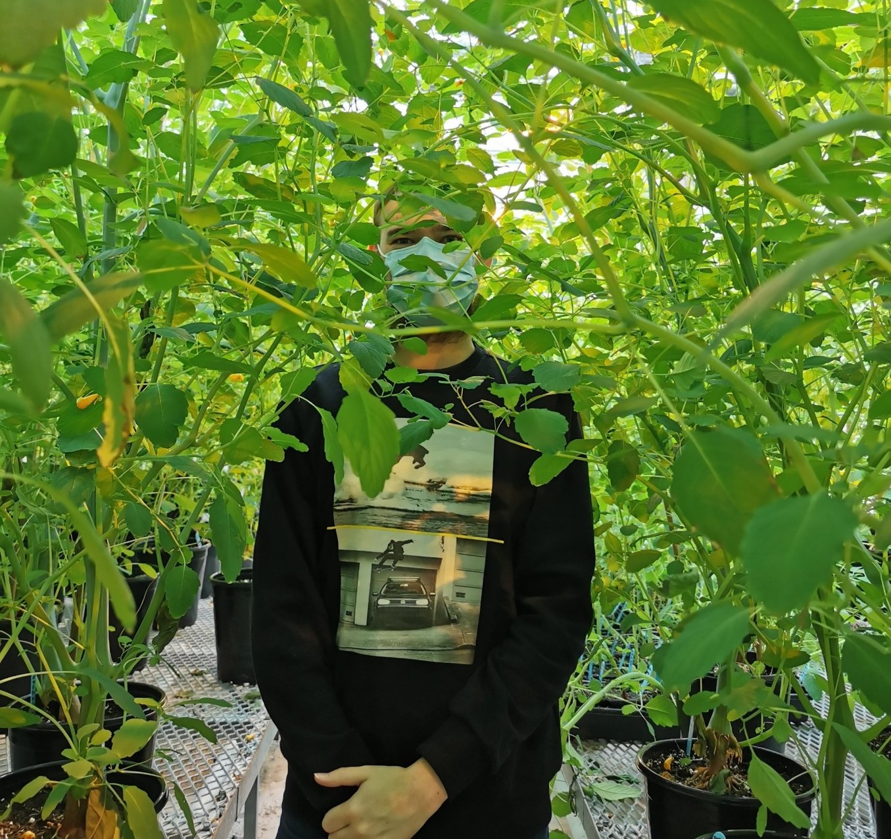

<h1> PhD Research </h1>

 
More than half of all human beings live in urban environments. Although cities occupy only 0.5% of the Earth's surface, they have a major impact on ecosystems and biodiversity through the destruction and fragmentation of habitats, pollution and increases in average temperatures (heat islands). By affecting biodiversity, cities also alter the interactions between living organisms. Flowers, for example, attract animals such as insects (bees, bumblebees, wasps, etc.) and birds (hummingbirds) to pollinate them so that they can reproduce. Over time, flowers have even developed special shapes and sizes so that when an animal visits a flower, it touches the stamens and carries more pollen to the pistil, ensuring efficient reproduction. However, urbanization is changing the abundance and diversity of pollinators. As a result of these changes, the shape and size of flowers can be expected to evolve to better suit local pollinators, enabling plants to reproduce more efficiently (natural selection). Yet, there are very few studies that investigated the impact of urbanization on flowers and their pollinators in urban environments.

 
My PhD focuses on three aspects of the spotted jewelweed flower evolution in an urbanization context: first, I compared urban and natural populations in the Quebec, Montreal, Ottawa, and Toronto regions, looking for flower morphology evolution in controlled and fieldwork conditions. Second, I studied natural selection on flower morphology in urban and natural contexts. Third, I collected material to find genetic loci associated with urbanization and conduct a GWAS to detect specific loci involved in the adaptation of flower morphology to urbanization.

 
Urbanization is drastically changing the environment in which organisms live. However, it also gives us a better understanding of its effects on the evolution of flowers. Understanding this phenomenon is essential: it paves the way for urban development solutions that make ecosystems more robust and resilient in the face of human pressures while guaranteeing the survival of ecosystem services that are essential to humans, such as pollination.

<figcaption style="text-align: center">Photographing flowers in a natural site near Montreal, and lost in my common garden experiment</figcaption>
</img-div>

<!-- Back to top button -->
<button type="button" class="btn btn-danger btn-floating btn-lg" id="btn-back-to-top">
  <i class="fas fa-arrow-up"></i>
</button>

